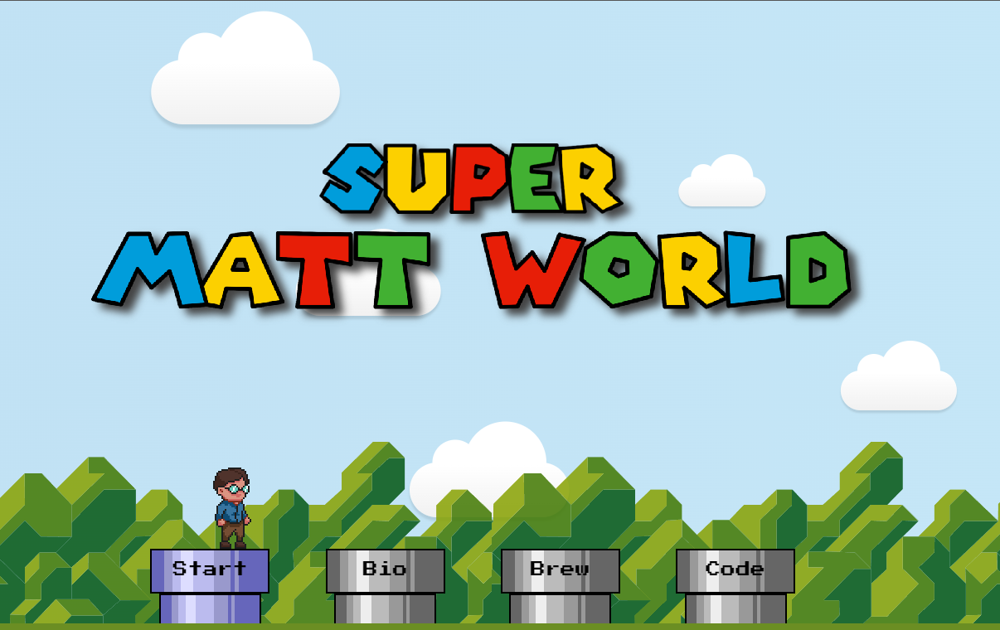

# Welcome to Super Matt World!

## [Play it here!](https://matt.westwick.dev)

## Background
This started as the side effect of discovering `requestAnimationFrame` when I was learning JavaScript. So I designed a [rudimentary physics engine](./dynamics.js) and created a "game" that allowed you to move a character around the screen. But what fun is a game without some challenge? So I added some [obstacles](./obstacles.js) and [collision detection](./collision.js). Now your character could jump on boxes!

At this point, I'd done everything in pure html/css/javascript without using any external libraries. So it became a challenge - _how far could I take this on my own_? In doing so, I've learned a _ton_ about how the native DOM works, the (sometimes frustrating) limitations of Javascript, and come to have a healthy respect for how front end frameworks work under the hood.

At this point, work got busy so I took a break. But recently, I had a crazy idea to turn this concept into a personal portfolio. So here we are!

## Future Ideas / Plans
* Solve the device pixel scaling issue once and for all!
* Add other sprites (such as 'enemies' and coins) that you can interact with
* Add a status bar with a score and timer (and maybe a leaderboard!)
* Mobile version with touch controls
* Customizeable player characters
* Custom level database

## License
This code is 100% free (as in beer) to use! See the [license](./LICENSE.md)

The only request I make is that if I inspired your project, that you let me know about it so I can check it out!

## Secret
Your character in the site can hack the world around him if they use their laptop. Maybe if you _Shift_ your perspective for a few seconds...
